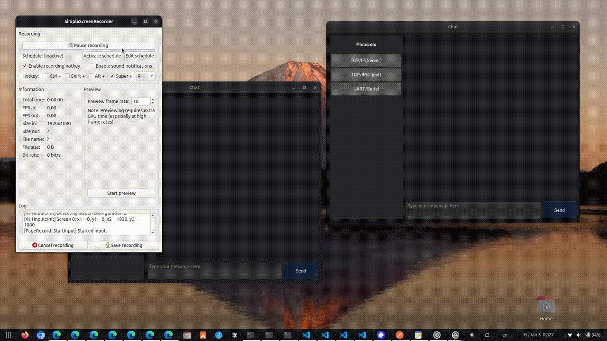

# Texting App for Raspberry Pi

## Introduction

This project is a messaging application developed using the Kivy framework. It supports multiple communication protocols and implements a client-server architecture, allowing for local network communication simulation.

## Features

- **Multi-Protocol Support**: 
  - TCP/IP Network Communication
    - Server mode (Master)
    - Client mode
  - UART/Serial Communication
  - Future protocol support:
    - SPI (Serial Peripheral Interface)
    - I2C (Inter-Integrated Circuit)
    - CAN (Controller Area Network)
    - EtherCAT (Ethernet for Control Automation Technology)

- **Modern UI Features**:
  - Dark theme interface
  - WhatsApp-style message bubbles
  - Real-time message updates
  - Protocol selection sidebar
  - Automatic scrolling to latest messages

- **Networking Features**:
  - TCP/IP socket communication
  - Client-Server architecture
  - Connection state management
  - Error handling and recovery

- **Data Persistence**:
  - SQLite database for message history
  - Protocol-specific message filtering
  - REST API for database operations

## Demo GIFs

### 1. Laptop Ubuntu Environment


### 2. Raspberry Pi 400 (Master Server)


### 3. Raspberry Pi 3B+ (Client)


## Technical Stack

- **Frontend**: Kivy Framework
- **Backend**: 
  - Python 3.x
  - Flask REST API
  - SQLite Database
- **Protocols**:
  - TCP/IP (Ethernet)
  - UART (Serial)

## Requirements

- Python 3.x
- Kivy
- Flask
- SQLite3
- Required Python packages:
  ```
  kivy
  flask
  requests
  sqlite3
  ```

## Setup

1. Clone the repository
2. Install dependencies
3. Run tests and save results:
   ```bash
   pytest -v --cov=. --cov-report=term-missing | tee test_results.txt
   ```

## Two-Pi Communication Setup

### On Server Pi (Pi400):
1. Get the IP address:
   ```bash
   ifconfig
   # Note down the IP address (e.g., 192.168.1.100)
   ```
2. Run the application:
   ```bash
   python chatapp.py
   ```
3. Select "TCP/IP(Server)" in the UI

### On Client Pi (Pi3B+):
1. Modify the chatapp.py file:
   ```python
   # Replace <MASTER_PI_IP> with the actual Master Pi IP
   self.protocol_handlers = {
       "Ethernet(Master)": EthernetMasterHandler(host="0.0.0.0", port=self.protocol_port),
       "Ethernet(Client)": EthernetClientHandler(host="192.168.1.100", port=self.protocol_port),
       "UART": UARTHandler(port="/dev/ttyUSB0", baudrate=9600),
   }
   ```
2. Run the application:
   ```bash
   python chatapp.py
   ```
3. Select "Ethernet(Client)" in the UI

### Troubleshooting
- Ensure both Pis are on the same network
- Check firewall settings:
  ```bash
  # On both Pis, allow incoming connections for both REST API and protocol ports
  sudo ufw allow 5000:5001/tcp
  ```
- Test network connectivity:
  ```bash
  # From Client Pi
  ping <MASTER_PI_IP>
  ```
- If connection fails, verify:
  - IP addresses are correct
  - Port 5001 is open for protocol communication
  - Port 5000 (or next available) is open for REST API
  - Both devices can see each other on network

## Configuration

The application uses the following ports:
- REST API server: starts from port 5000, finds next available if busy
- Protocol communication: fixed at port 5001 for easier configuration

## Usage and Roadmap

1. Start the application
2. Select a protocol:
   - TCP/IP(Server): Acts as network server
   - TCP/IP(Client): Connects to server
   - UART/Serial: For serial port communication
   - (Future) SPI: For high-speed, short-distance communication
   - (Future) I2C: For inter-chip communication
   - (Future) CAN: For robust industrial communication
   - (Future) EtherCAT: For real-time industrial Ethernet
   - (Future) MQTT: Lightweight messaging for IoT applications.
   - (Future) Modbus: Industrial communication protocol (RTU and TCP).
   - (Future) WebSocket: Real-time, bidirectional communication.
   - (Future) Bluetooth Low Energy (BLE): Wireless communication.
   - (Future) Zigbee/Z-Wave: Smart home and IoT protocols.
3. Messages will appear in real-time.
4. Connection status is shown in system messages.
5. Planned features:
   - User-defined Master Server IP.
   - Optimize performance for Raspberry Pi 3B+ using RPI OS Lite.
   - Advanced error handling and retry mechanisms for protocol failures.
   - Enhanced UI performance and responsiveness.

## Architecture

- **Modular Protocol System**: Extensible protocol handlers
- **MVC-like Structure**: Separation of UI, logic, and data
- **Event-Driven**: Real-time message handling
- **REST API**: Database operations via HTTP endpoints
